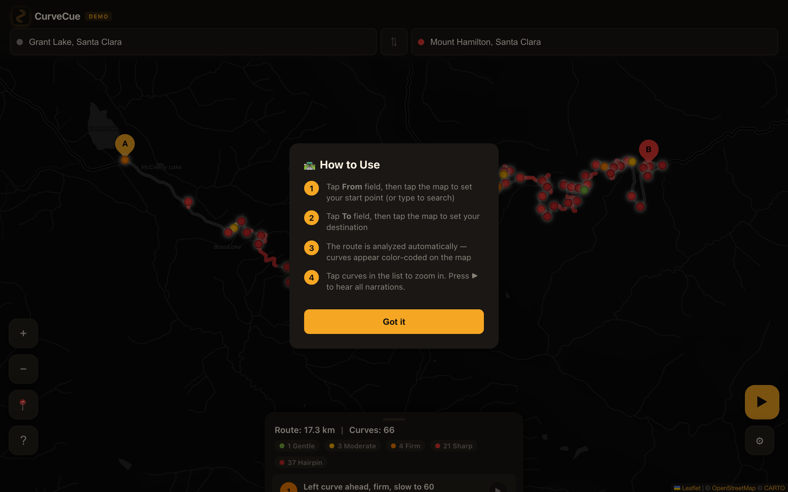
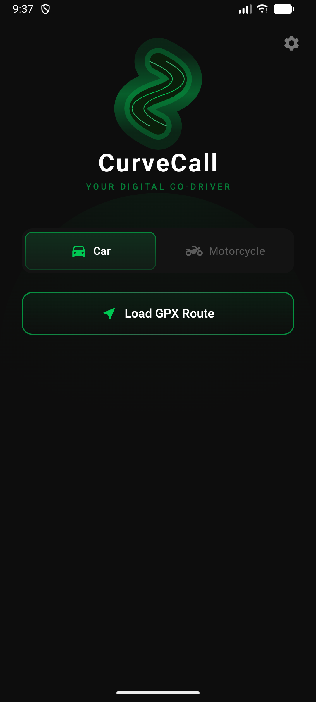

# CurveCue

**Your digital co-driver.** CurveCue is a real-time curve detection engine that reads the road ahead — narrating curves, severity, and speed advisories before you reach them.

Built for spirited drives on mountain roads, track days with unfamiliar layouts, and motorcycle touring through twisties.

<p align="center">
  <a href="https://mhathiyari.github.io/curve-call/"></a>
  
  <a href="LICENSE"></a>
</p>

---

<p align="center">
  
</p>

<p align="center">
  
</p>

<p align="center">
  <sub>Web demo analyzing Mt Hamilton Rd — 66 curves detected and color-coded by severity</sub>
</p>

## Try It

**[Live Web Demo](https://mhathiyari.github.io/curve-call/)** — pick any two points on a map, and CurveCue analyzes the route in real time. Tap curves to hear voice narrations.

The Android app is coming soon to the Google Play Store.

## How It Works

1. **Pick a route** — Tap start/end points on the map or search by address
2. **Automatic analysis** — The engine interpolates the route, computes Menger curvature at every point, segments curves, classifies severity, and calculates safe speeds
3. **Voice narration** — Each curve is announced before you reach it: direction, severity, speed advisory, and modifiers

Example narrations:
- *"Left curve ahead, moderate"*
- *"Sharp right ahead, slow to 35"*
- *"Hairpin left ahead, slow to 20, tightening"*
- *"S-bend, right into left, sharp"*

## Features

- **5 severity levels** — Gentle (>200m), Moderate (100–200m), Firm (50–100m), Sharp (25–50m), Hairpin (<25m)
- **Compound detection** — S-bends, chicanes, and series of linked curves identified as a single narration
- **Speed advisories** — Physics-based safe speed from curve radius and lateral G-force limits
- **Adaptive timing** — Narration trigger distance adjusts based on current speed and braking physics
- **Motorcycle mode** — Lean angle suggestions, surface condition warnings, sportier timing
- **Configurable verbosity** — Terse (sharp + hairpin only), Standard (moderate+), or Descriptive (everything)
- **Winding detection** — Detects 6+ curve clusters with overview narration
- **Spatial audio** — Stereo pre-cue tones panned by curve direction
- **Road metadata** — Surface type, road name, and conditions integrated into narrations
- **Dark theme** — Always-dark UI optimized for minimal glare

<p align="center">
  
  <br />
  <sub>Android app home screen</sub>
</p>

## Architecture

Three pure-Kotlin modules with a clean separation between logic and platform code:

```
curve_call/
├── engine/          Pure Kotlin — route analysis pipeline
├── narration/       Pure Kotlin — TTS text generation & timing
├── app/             Android — UI, GPS, audio, DI
└── web-demo/        Standalone HTML/JS demo (port of engine)
```

### Engine Pipeline

Transforms raw GPS coordinates into classified curve segments through an 8-stage pipeline:

```
GPX Points → Interpolation (10m spacing) → Curvature (Menger) → Segmentation
→ Classification (severity, direction, modifiers) → Speed Advisory (lateral G)
→ Lean Angle → Compound Detection (S-bends) → Data Quality (confidence)
```

### Narration Module

Generates natural language from curve data and decides *when* to speak based on a kinematic model:

```
Trigger Distance = TTS Duration + Reaction Time + Braking Distance (v²/2a)
```

Three timing profiles — Relaxed (2.0s reaction), Normal (1.5s), Sporty (1.2s) — with immediate voice chaining for consecutive curve announcements.

### App Module

- **Jetpack Compose** UI with Material 3
- **Hilt** dependency injection
- **MVVM** with StateFlow
- **osmdroid** for OpenStreetMap rendering
- **FusedLocationProvider** for GPS at 1Hz
- **Foreground Service** keeps GPS + TTS alive when backgrounded

## Building

**Requirements:** Android Studio Hedgehog+, JDK 21, Android SDK 34

```bash
git clone https://github.com/mhathiyari/curve-call.git
cd curve-call

# Build debug APK
./gradlew assembleDebug

# Run engine + narration tests
./gradlew :engine:test :narration:test
```

**Min SDK:** 26 (Android 8.0) &nbsp;|&nbsp; **Target SDK:** 34 (Android 14)

## Tests

372+ unit tests across the engine and narration modules:

```bash
# Run all tests
./gradlew test

# Engine tests (150 tests — pipeline, geometry, MapMatcher, switchback detection)
./gradlew :engine:test

# Narration tests (222 tests — templates, timing, queue, verbosity, winding, suppression)
./gradlew :narration:test
```

## Tech Stack

| Layer | Technology |
|---|---|
| UI | Jetpack Compose, Material 3, Navigation Compose |
| DI | Hilt |
| State | ViewModel + StateFlow |
| Maps | osmdroid (OpenStreetMap) |
| GPS | Google Play Services FusedLocationProvider |
| Audio | Android TextToSpeech, AudioManager |
| Network | OkHttp (Overpass API) |
| Storage | DataStore Preferences |
| Build | Gradle Kotlin DSL, AGP 8.2.2, Kotlin 1.9.22 |

## Safety

CurveCue is a **driving aid**, not a safety system. Speed advisories and lean angle suggestions are calculated estimates based on road geometry only. They do not account for surface condition, weather, traffic, visibility, or vehicle capability. The driver is solely responsible for all driving decisions. Never interact with the UI while driving — use audio narration only.

## Disclaimer

**This software is experimental and provided strictly "as is."** CurveCue is a personal project in active development and is NOT intended for use as a reliable navigation or safety system. By using this software, you acknowledge and agree that:

- The app may contain bugs, produce inaccurate narrations, give incorrect speed advisories, or fail without warning.
- You use CurveCue entirely **at your own risk**. The developer(s) accept **no responsibility or liability** for any damage, injury, accident, loss, or death arising from the use or misuse of this software.
- CurveCue is not a substitute for attentive driving, proper route planning, or any certified navigation/safety system.
- All driving decisions remain solely your responsibility at all times.
- This software should never be relied upon as your primary or sole source of road information.

**If you are not comfortable with these terms, do not use this software.**

## License

[MIT](LICENSE) — Copyright (c) 2025 Mustafa Hathiyari
